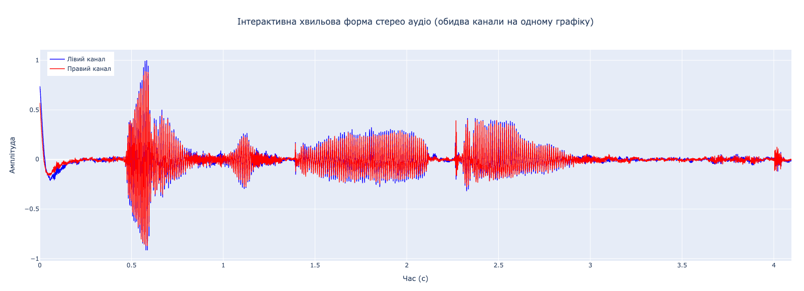
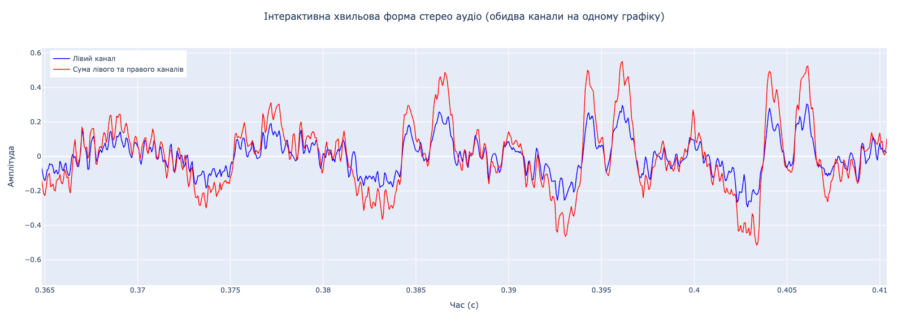
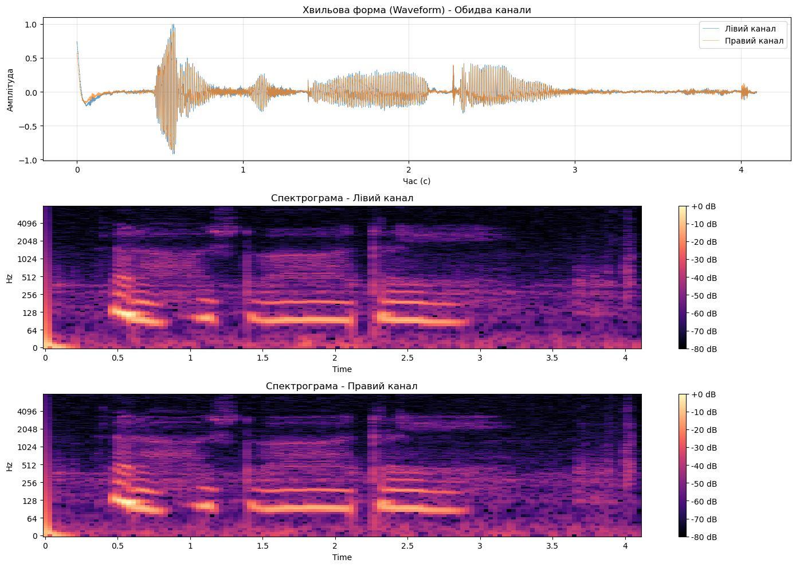

# **Тиждень 2. Щотижневий звіт про прогрес виконання дипломної роботи**

**Тема:** Система інтелектуальної діагностики технічних пристроїв на основі акустичних сигналів з використанням методів машинного навчання

## 1. Опис виконаних завдань та прогрес (MVP Phase 1)

Цей тиждень був присвячений практичній реалізації апаратної частини (Hardware) та налагодженню пайплайну збору даних "Device-to-PC".

* **Створено репозиторій проєкту:** Ініціалізовано Git-репозиторій, налаштовано структуру проєкту для прошивки (ESP-IDF) та скриптів обробки даних (Python).
* **Апаратна реалізація (Hardware Setup):**
    * Зібрано прототип на базі **ESP32-S3** (DevKit) та мікрофонної пари.
    * Виконано фізичне підключення мікрофонів через інтерфейс **I2S**:
        * GPIO 4 — BCLK (Bit Clock)
        * GPIO 5 — WS (Word Select)
        * GPIO 7 — DIN (Data Input)
* **Розробка Firmware (Embedded):**
    * Написано драйвер для конфігурації I2S у режимі *Master Receiver* з використанням ESP-IDF API (`i2s_std.h`).
    * Реалізовано буферизацію даних за допомогою DMA з чергою розміром 8 буферів (`DMA_BUFFER_QUEUE_SIZE = 8`) для безперервного потокового запису аудіо без втрати семплів.
    * Налаштовано параметри оцифрування:
        * Частота дискретизації: **16 кГц** (`I2S_SAMPLING_RATE = 16000`)
        * Розрядність: **32 біти** (`I2S_DATA_BIT_WIDTH_32BIT`) на вході від мікрофонів
        * Формат каналів: **Стерео (2 канали)** (`I2S_SLOT_MODE_STEREO`)
        * Режим: **Philips I2S** з увімкненим bit shift (`bit_shift = true`)
    * Реалізовано запис даних у Flash пам'ять через окрему задачу (`flash_write_task`) з пропуском перших 20 мс запису для стабілізації сигналу.
    * Додано управління записом через кнопку BOOT (GPIO 0): коротке натискання — старт/стоп запису, довге натискання — очищення Flash.
* **Розробка Software (PC Side):**
    * Написано Python-скрипт `bin2wav.py` для конвертації бінарних даних з Flash у формат WAV з підтримкою перевірки CRC32.
    * Створено bash-скрипт `get_wav_from_flash.sh` для автоматичного читання даних з Flash через `esptool` та конвертації у WAV.
    * Реалізовано нормалізацію семплів та підтримку 16-bit та 32-bit форматів.

## 2. Результати Першого Демо та Висновки

В рамках першого демо було протестовано роботу наскрізного каналу передачі звуку (Мікрофон $\rightarrow$ ESP32 $\rightarrow$ I2S $\rightarrow$ Flash $\rightarrow$ UART $\rightarrow$ PC $\rightarrow$ WAV).

**Ключові результати аналізу:**
1.  **Якість сигналу:** Проведено візуальний та слуховий аналіз записаних доріжок. Оцінено вейвформи (Waveforms) на предмет кліппінгу та спектрограми (Spectrograms) для перевірки частотного діапазону.
2.  **Стерео-ефект:** Підтверджено наявність фазової різниці між каналами, що в майбутньому дозволить реалізувати алгоритми фільтрації шумів.
    

**Стратегічне рішення (Pivot):**
За результатами тестування та оцінки складності комутації прийнято рішення **обмежити апаратну реалізацію MVP двома мікрофонами (стерео-пара)** замість запланованих раніше чотирьох або восьми.
* *Обґрунтування:* Конфігурація з 2 мікрофонами є достатньою (Minimum Viable) для перевірки гіпотези про детекцію аномалій та базову просторову фільтрацію. Це дозволить суттєво зекономити час на налагодженні синхронізації каналів та сфокусуватися на розробці ML-алгоритмів, що є основною цінністю роботи.

## 3. Ризики, виклики та їх вирішення

Основні труднощі тижня були пов'язані з протоколом I2S та цілісністю даних.

* **Проблема 1:** Артефакти у звуковому записі та "зсув" бітів в семплах по можному каналу.
    * *Причина:* Некоректна конфігурація I2S інтерфейсу — відсутність налаштування `bit_shift` для Philips I2S формату та неправильна конфігурація слотів.
    * *Рішення:* Відлагоджено налаштування `i2s_std_config_t`:
        * Увімкнено `bit_shift = true` для коректної обробки Philips I2S формату (стандартні I2S мікрофони використовують зсув на 1 біт)
        * Налаштовано `slot_cfg.slot_mode = I2S_SLOT_MODE_STEREO` для коректної обробки двох каналів
        * Встановлено `dma_frame_num = 256` та `dma_desc_num = 8` для оптимальної буферизації

* **Проблема 2:** Викривлені дані з мікрофонів та необхідність конвертації формату
    * *Причина:* Дані з мікрофонів по I2S надходять у форматі 32-біт signed integers, але для зручності роботи та економії Flash пам'яті потрібно конвертувати в 16-бітний формат без втрати важливої інформації та з урахуванням знаку. Також мікрофони передають дані в інтерлівованому форматі (L0, R0, L1, R1, ...), що потребує правильної обробки.
    * *Рішення:* Реалізовано функцію `process_i2s_and_write_to_flash_non_secure()`, яка:
        * Витягує дані з інтерлівованого потоку
        * Конвертує 32-бітні значення в 16-бітні через вибірку старших 16 біт (молодші 16 біт містять переважно шум та не несуть значущої інформації)
        * Правильно обробляє знакові значення через `ctypes.c_int16` для збереження коректного діапазону [-32768, 32767]
        * Реалізовано нормалізацію семплів у `bin2wav.py` для коректного відображення амплітуди при конвертації у WAV формат
    
* **Проблема 3:** Втрата даних при передачі їх через UART
    * *Причина:* Велика швидкість передачі (2000000 baud) та перешкоди-наводки на проводах призводили до пошкодження даних під час передачі з Flash через UART.
    * *Рішення:* 
        * Підібрано оптимальну швидкість передачі: **2 Мбод** (`baud=2000000`) для стабільної роботи з мінімальними помилками
        * Реалізовано перевірку цілісності даних через CRC32: функція `calculate_crc32()` у `bin2wav.py` використовує той самий алгоритм, що й ESP-IDF (`esp_rom_crc32_le`)
        * Додано можливість перевірки CRC32 при конвертації через параметр `-C` у скрипті `bin2wav.py`
        * Змінено архітектуру: замість передачі через UART в реальному часі, дані спочатку записуються у Flash пам'ять, а потім читаються через `esptool` — це гарантує цілісність даних

## 4. План роботи на наступний тиждень (Тиждень 3)

Фокус зміщується з "інженерії заліза" на "Data Science" та збір датасету.

1.  **Збір даних (Data Collection):** Записати набір тестових звуків реальних механізмів (наприклад, електродвигун/кулер) у станах "Норма" та "Аномалія" (імітація дисбалансу або перешкоди).
2.  **Пошук датасетів:** Знайти наявні датасети, що можуть бути застосовані для задачі детекції аномалій у промислових механізмах. Оцінити можливість їх використання для попереднього навчання моделі або як baseline для порівняння результатів.
3.  **Exploratory Data Analysis (EDA):** Завантажити дані в Jupyter Notebook. Побудувати Mel-спектрограми та провести кореляційний аналіз каналів.
4.  **Feature Extraction:** Визначити, які ознаки (MFCC, Zero-Crossing Rate, Spectral Rolloff) найкраще розділяють класи "Норма" і "Аномалія" на зібраних даних.
5.  **Підготовка до моделювання:** Знайти джерела по роботі зі звуком в ML/DL. Вивчити матеріали. Визначитися з напрямками реалізації "Data Science" складовою проєкту.

## 5. Артефакти

* **GitHub Репозиторій:** Структура проєкту організована наступним чином:
    * `project/dev/main/i2s_main.c` — основна прошивка для ESP32-S3 з драйвером I2S
    * `project/host/tools/bin2wav.py` — Python-скрипт для конвертації бінарних даних у WAV
    * `project/host/tools/get_wav_from_flash.sh` — bash-скрипт для автоматичного зчитування та конвертації
    * `project/sandbox.ipynb` — Jupyter Notebook для аналізу записаних аудіо даних

* **Скріншоти:**

    **Фото зібраного макету ESP32-S3 + мікрофони:**
    
    
    
    На фото видно прототип системи: ESP32-S3 DevKit з підключеними двома I2S мікрофонами через інтерфейс I2S. Мікрофони розташовані на відстані приблизно 145 мм один від одного (відстань наближено дорівнює відстані між вухами людини) для реалізації стерео-ефекту та просторової фільтрації.

    **Хвильова форма записаного стерео сигналу (оба канали):**
    
    
    
    На графіку видно два канали (лівий — синій, правий — червоний).

    **Детальний вигляд хвильової форми (зум):**
    
    
    
    Збільшений фрагмент сигналу демонструє якість запису: відсутність кліппінгу, коректну амплітуду та чітку різницю між каналами на рівні окремих семплів.

    **Спектрограма записаного сигналу:**
    
    
    
    Спектрограма показує частотний склад записаного сигналу для обох каналів. Видно, що сигнал охоплює діапазон від низьких частот (приблизно 20-50 Гц) до високих (до 8 кГц), що відповідає частоті дискретизації 16 кГц. Спектральні характеристики обох каналів майже ідентичні, що підтверджує коректну роботу апаратури та відсутність артефактів.

